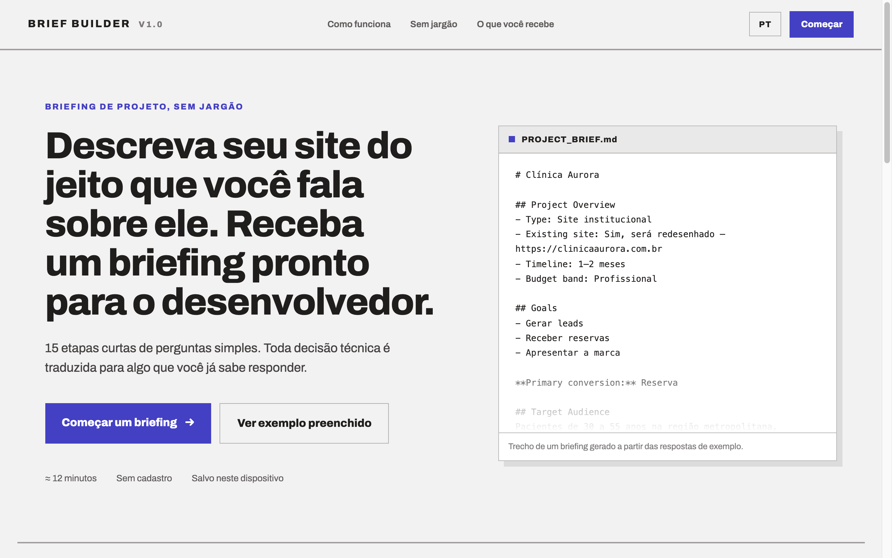
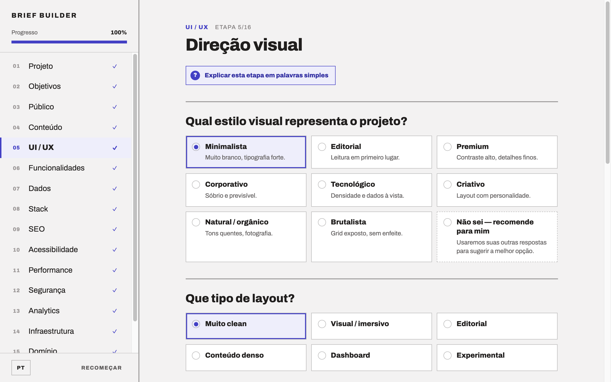
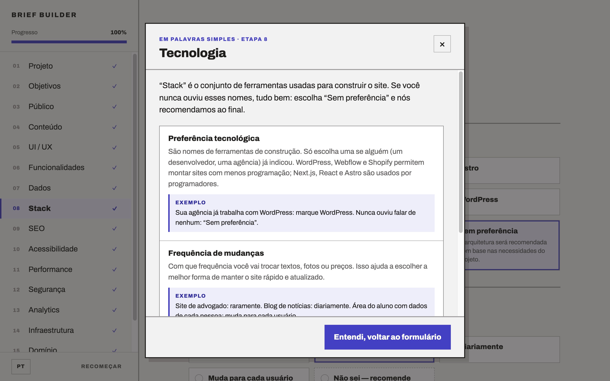
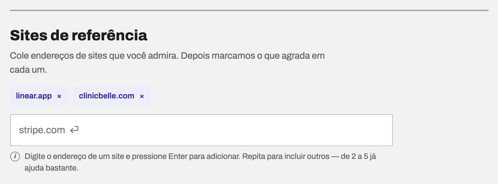
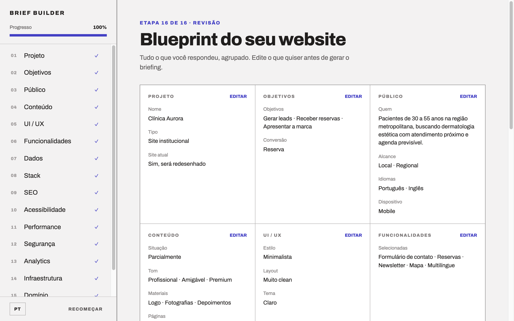
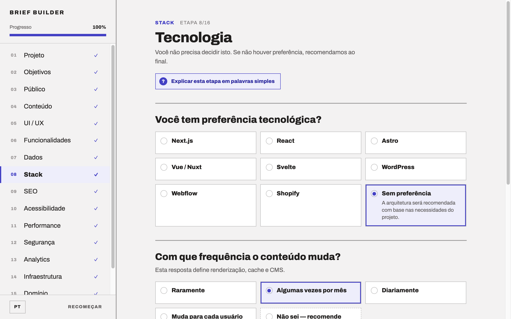
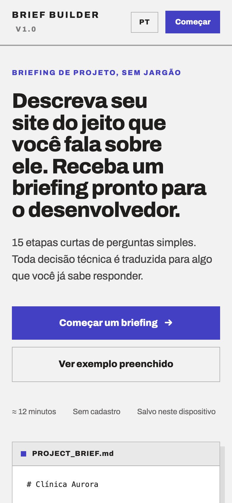
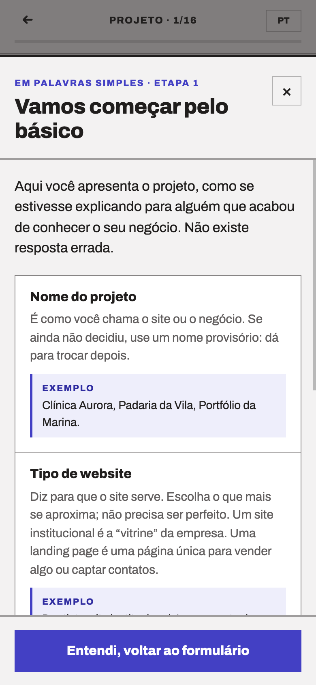
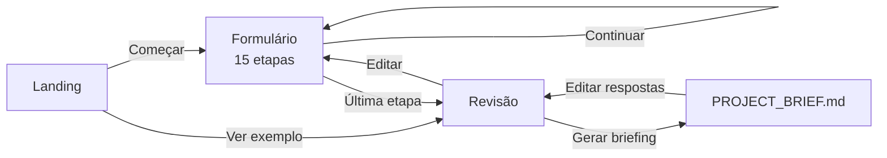

# Brief Builder

**Descreva seu site do jeito que você fala sobre ele. Receba um briefing pronto para o desenvolvedor.**

Brief Builder é um formulário guiado que transforma respostas em linguagem simples em um documento técnico (`PROJECT_BRIEF.md`) e em uma recomendação de arquitetura. Ele foi pensado para quem contrata ou planeja um site sem conhecer o vocabulário técnico: cada decisão de tecnologia é traduzida em uma pergunta que a pessoa já sabe responder.



- [Funcionalidades](#funcionalidades)
- [Telas](#telas)
- [Como funciona](#como-funciona)
- [As 15 etapas](#as-15-etapas)
- [Começando](#começando)
- [Estrutura do projeto](#estrutura-do-projeto)
- [Como o conteúdo é modelado](#como-o-conteúdo-é-modelado)
- [Testes](#testes)
- [Deploy e analytics](#deploy-e-analytics)

## Funcionalidades

- **Landing page** com o link para iniciar o formulário, explicação do fluxo e uma prévia real do briefing gerado.
- **15 etapas de perguntas simples**, do nome do projeto até domínio, orçamento e prazo, mais uma etapa final de revisão.
- **Fluxo adaptativo:** algumas respostas abrem perguntas extras (por exemplo, marcar "Pagamentos" pergunta as formas de pagamento) e seções irrelevantes ficam de fora.
- **Modo "palavras simples" para pessoas não técnicas:** cada etapa tem um botão que abre um modal com a explicação do que está sendo perguntado e exemplos do dia a dia.
- **Helper text nos campos livres:** sites de referência, palavras-chave, concorrentes, nome, endereço, público e domínio trazem uma dica curta abaixo do campo.
- **Saída "Não sei — recomende para mim"** nas perguntas mais técnicas.
- **Blueprint revisável:** todas as respostas agrupadas por tema, com edição direta antes de gerar o documento.
- **Arquitetura recomendada,** derivada das respostas (frontend, CMS, banco de dados, hospedagem, autenticação, analytics).
- **Exportação em Markdown:** copiar ou baixar o `PROJECT_BRIEF.md`.
- **Português e inglês,** com troca de idioma em qualquer tela.
- **Progresso salvo no navegador** (`localStorage`); as respostas não são enviadas a nenhum servidor.
- **Responsivo,** com cabeçalho e modal adaptados ao celular.

## Telas

### Formulário

Uma pergunta por bloco, coluna de conteúdo centralizada, sidebar fixa com progresso e navegação entre etapas, e o botão de ajuda em cada etapa.



### Explicação em palavras simples

O botão "Explicar esta etapa em palavras simples" abre um modal com o que cada pergunta significa e um exemplo concreto. O modal usa o elemento `<dialog>` nativo: foco preso, `Esc` para fechar, clique fora para fechar e rolagem da página travada enquanto está aberto.



### Helper text

Campos livres têm uma dica informativa abaixo do input, ligada ao campo por `aria-describedby`.



### Revisão e briefing

Ao final, o blueprint agrupa as respostas por tema, com um botão de edição em cada grupo, e a arquitetura recomendada logo abaixo. Em seguida, o `PROJECT_BRIEF.md` fica pronto para copiar ou baixar.

| Blueprint | `PROJECT_BRIEF.md` |
|---|---|
|  |  |

### Mobile

| Landing | Modal de ajuda |
|---|---|
|  |  |

## Como funciona

O app é uma aplicação de página única sem roteador: a tela atual é um estado (`start`, `flow`, `review` ou `brief`) mantido por um reducer em [`useBriefBuilder`](src/hooks/useBriefBuilder.ts).



Como não há rotas, a URL não muda entre as telas. O estado (idioma, tela, etapa e respostas) é gravado em `localStorage` na chave `brief-builder:v1`, então recarregar a página retoma de onde a pessoa parou.

### Arquitetura recomendada

A função [`recommendArchitecture`](src/domain/architecture.ts) deriva sugestões das respostas:

| Papel | Regra |
|---|---|
| Frontend | A preferência declarada; senão `Next.js + Shopify` para e-commerce; `Astro` quando o conteúdo muda pouco e não há áreas dinâmicas; `Next.js` nos demais casos |
| Styling | CSS por componente |
| CMS | `Markdown no repositório` para conteúdo fixo; `Sanity` nos demais casos |
| Database | `PostgreSQL` se o site guarda informações; nenhum caso contrário |
| Auth | `Auth.js`, apenas se os usuários criam conta |
| Hosting | `Vercel` |
| Analytics | `Plausible`, ou nenhum se a pessoa não quer acompanhar visitantes |

São sugestões, não decisões: a tela de revisão deixa isso explícito.

## As 15 etapas

| # | Etapa | O que pergunta |
|---|---|---|
| 01 | Projeto | Nome, tipo de site, se já existe um site e qual o endereço |
| 02 | Objetivos | O que o site precisa alcançar e qual a principal conversão |
| 03 | Público | Quem é, onde está, idiomas, dispositivo e familiaridade com tecnologia |
| 04 | Conteúdo | Situação do conteúdo, quem escreve, tom de voz, materiais e páginas |
| 05 | UI / UX | Estilo visual, layout, identidade, tema e sites de referência |
| 06 | Funcionalidades | Formulários, login, pagamentos, reservas, busca e outras |
| 07 | Dados | O que o site precisa guardar, contas de usuário e níveis de acesso |
| 08 | Stack | Preferência tecnológica, frequência de mudança e quem edita o conteúdo |
| 09 | SEO | Prioridade, dependência de tráfego orgânico, palavras-chave e concorrentes |
| 10 | Acessibilidade | Nível de acessibilidade desejado |
| 11 | Performance | Prioridade de velocidade e volume de mídia |
| 12 | Segurança | Dados pessoais coletados e requisitos de privacidade |
| 13 | Analytics | Se querem acompanhar visitantes e com quais ferramentas |
| 14 | Infraestrutura | Hospedagem existente e prioridade de infraestrutura |
| 15 | Domínio | Domínio, orçamento, prazo e quem faz a manutenção |
| 16 | Revisão | Blueprint com todas as respostas e a arquitetura recomendada |

Perguntas condicionais aparecem só quando fazem sentido, por exemplo: endereço atual (se já existe um site), formas de pagamento (se marcou pagamentos ou carrinho), métodos de login e níveis de acesso (se há contas de usuário), ferramentas de analytics (se quer acompanhar visitantes) e privacidade e consentimento (se coleta dados pessoais).

## Começando

### Requisitos

- Node.js `^20.19.0` ou `>=22.12.0` (exigência do Vite 8)
- npm

### Instalação e execução

```bash
git clone https://github.com/GutuGaluppo/scopo.git
cd scopo
npm install
npm run dev
```

O servidor de desenvolvimento sobe em `http://localhost:5173`.

### Scripts

| Comando | O que faz |
|---|---|
| `npm run dev` | Servidor de desenvolvimento com HMR |
| `npm run build` | Checagem de tipos (`tsc -b`) e build de produção em `dist/` |
| `npm run preview` | Serve o build de produção localmente |
| `npm test` | Roda a suíte de testes com Vitest |

### Stack

React 19 · TypeScript 7 · Vite 8 · Vitest 5 · `@vercel/analytics`. Sem biblioteca de UI ou de estilos: o CSS é escrito por componente, com tokens globais em [`tokens.css`](src/styles/tokens.css) e a fonte Archivo.

## Estrutura do projeto

```text
src/
├── App.tsx                    # Escolhe a tela a partir do estado
├── main.tsx                   # Entrada; monta o app e o Vercel Analytics
├── components/
│   ├── LandingPage/           # Landing com o link para iniciar o formulário
│   ├── Sidebar/               # Progresso e navegação entre etapas (desktop)
│   ├── MobileHeader/          # Cabeçalho equivalente no celular
│   ├── FlowScreen/            # Uma etapa do formulário + botão de ajuda
│   ├── QuestionField/         # Renderiza cada tipo de pergunta e o helper text
│   ├── GuideModal/            # Modal "em palavras simples" (<dialog> nativo)
│   ├── ReviewScreen/          # Blueprint e arquitetura recomendada
│   └── BriefScreen/           # PROJECT_BRIEF.md: copiar e baixar
├── data/
│   ├── steps.ts               # As 15 etapas e suas perguntas
│   ├── guides.ts              # Explicações e exemplos por etapa
│   ├── landing.ts             # Textos da landing page
│   └── sample.ts              # Respostas do "exemplo preenchido"
├── domain/
│   ├── architecture.ts        # Recomendação de arquitetura
│   ├── markdown.ts            # Geração do PROJECT_BRIEF.md
│   ├── review.ts              # Agrupamento das respostas para a revisão
│   └── i18n.ts                # translate() e formatAnswer()
├── hooks/useBriefBuilder.ts   # Estado, persistência e navegação
├── styles/                    # tokens.css e global.css
└── types/brief.ts             # Tipos compartilhados
docs/screenshots/              # Imagens usadas neste README
```

## Como o conteúdo é modelado

### Textos em dois idiomas

Todo texto de conteúdo é uma string `"português|english"`, resolvida por [`translate()`](src/domain/i18n.ts). As respostas também são guardadas assim, então trocar o idioma reescreve a tela e o briefing sem perder nada. Por isso um texto **não pode conter o caractere `|`**.

### Adicionar ou alterar uma pergunta

As perguntas ficam em [`src/data/steps.ts`](src/data/steps.ts). Campos de uma `Question`:

| Campo | Uso |
|---|---|
| `id` | Chave da resposta |
| `type` | `text`, `long`, `tags`, `scale` ou `cards` (padrão) |
| `t` / `help` / `ex` | Título, texto de apoio e exemplo |
| `ph` / `hint` | Placeholder e helper text abaixo do input |
| `opts` | Opções, como texto ou `{ t, d, rec }` (com descrição e marca de recomendação) |
| `multi` / `max` / `cols` | Seleção múltipla, limite de escolhas e colunas |
| `conditional` | Função que decide se a pergunta aparece |

### Adicionar ou alterar uma explicação em palavras simples

As explicações ficam em [`src/data/guides.ts`](src/data/guides.ts), indexadas pela `key` da etapa. Cada item tem `title`, `explain` e `example`.

Ao criar uma etapa nova, lembre-se de:

1. Criar o guia correspondente em `guides.ts`.
2. Conferir os índices fixos de etapa usados em [`review.ts`](src/domain/review.ts).

## Testes

```bash
npm test
```

| Arquivo | O que garante |
|---|---|
| `architecture.test.ts` | Recomenda Astro para conteúdo estático que muda pouco e respeita a preferência tecnológica declarada |
| `markdown.test.ts` | O `PROJECT_BRIEF.md` inclui nome, objetivos e a stack recomendada |
| `guides.test.ts` | Toda etapa tem guia, sem guias órfãos, tudo escrito em PT e EN |
| `steps.test.ts` | Todo input livre (`text`, `long`, `tags`) tem helper text nos dois idiomas |

## Deploy e analytics

O build é estático: `npm run build` gera a pasta `dist/`.

O projeto inclui o [Vercel Web Analytics](https://vercel.com/docs/analytics/quickstart) via `<Analytics />` de `@vercel/analytics/react` em [`main.tsx`](src/main.tsx). Para começar a coletar dados:

1. Ative o **Web Analytics** no painel da Vercel (Analytics → Enable).
2. Publique o app na Vercel. O script `/_vercel/insights/script.js` só existe em deploys da Vercel; em outro host, ou em `localhost`, nada é coletado.

Como o app não tem roteador, o Analytics conta a visita à página, mas não a passagem entre landing, etapas e revisão.

## Licença

Ainda não definida.
